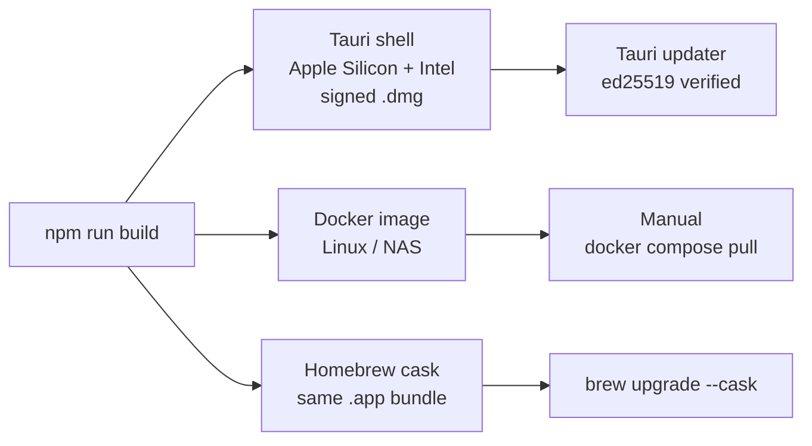
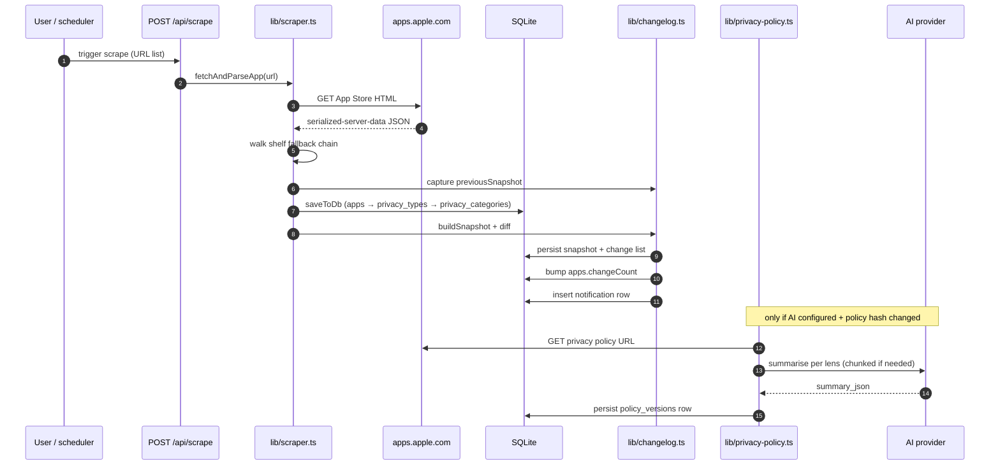
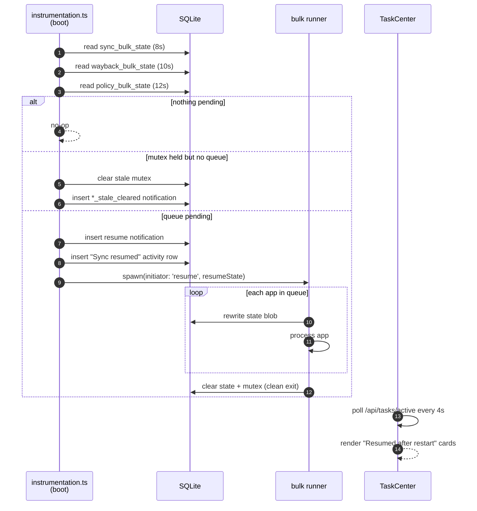

A Next.js 16 App Router app, written in TypeScript, backed by a single local SQLite file. All scraping, parsing, AI calls, and snapshotting happen server-side inside API routes that import helpers from `lib/`. Tauri wraps the same Next.js bundle as a desktop app; Docker ships the same bundle as a self-hosted service.

<Note>
  This page is the "where do I look?" layer. The dense, byte-level engineering reference is in `AGENTS.md` and `CLAUDE.md` at the repo root — coding agents read those directly.
</Note>

## Three distribution surfaces, one bundle



The same Next.js standalone bundle drives all three. Tauri runs it as a sidecar Node process; Docker runs it directly; Homebrew installs the same `.app` bundle as the desktop release.

## Shape of the codebase

```
privacytracker/
├── app/                        Next.js App Router pages + API routes
│   ├── api/                    thin wrappers over lib/*
│   ├── components/             large client components (OnboardWizard, SettingsView, AppDetailView, AppGrid, TaskCenter…)
│   ├── dashboard/              server pages that hand off to client components
│   ├── onboard/                audience picker → import wizard
│   ├── apps/[id]/              app detail + change history
│   └── globals.css             design tokens, severity colours, .legal-layout primitives
├── lib/                        server-side logic — most of the product lives here
├── src-tauri/                  Rust desktop shell + sidecar lifecycle
├── scripts/                    out-of-band scripts (ios-app-import companion, screenshot capture, standalone staging)
├── deploy/                     reference reverse-proxy stacks (caddy/, traefik/)
├── tests/                      node:test suites + Playwright specs
├── locales/                    en.json / zh.json translation bundles
├── public/                     static assets served by Next
├── docs/                       in-repo notes (the published site lives in privacytracker-docs)
├── data/privacy.db             SQLite database (gitignored; bind-mounted in Docker)
└── AGENTS.md / CLAUDE.md       coding-agent instructions
```

The cask formula is **not** in this repo — it lives in [privacykey/homebrew-tap](https://github.com/privacykey/homebrew-tap) at `Casks/privacytracker.rb`, regenerated by the release workflow on every tag.

## Core data flow

One scrape, one pass through the seven-step loop:



The two patterns to internalise:

- **Capture `previousSnapshot` *before* `saveToDb`.** `saveToDb` wipes and re-inserts `privacy_types` for the app inside a transaction, so capturing after gives you an empty baseline and the diff loses every row.
- **Apple's payload may unwrap two ways.** Always use `Array.isArray(raw) ? raw : raw.data` — Apple ships `{ data: [...], userTokenHash }` sometimes and a bare array other times.

Re-syncs run the same path with `resync=true` — that's what produces change notifications.

## The shelf fallback chain

```mermaid
flowchart TD
    start([App Store HTML]) --> a{shelfMapping.<br/>privacyTypes.items?}
    a -- yes --> use1[parse modern shape]
    a -- no --> b{privacyHeader.<br/>seeAllAction.<br/>pageData.shelves?}
    b -- yes --> use2[parse legacy purposes →<br/>categories, flatten]
    b -- no --> c{generic<br/>pageData.shelves?}
    c -- yes --> use3[parse generic shelves]
    c -- no --> d{shoebox-media-api-<br/>cache-apps script?<br/>(Jan 2021 – Nov 2025)}
    d -- yes --> use4[parse Ember/FastBoot<br/>shoebox shape]
    d -- no --> bail[log + skip]
    use1 --> done([persist])
    use2 --> done
    use3 --> done
    use4 --> done
```

If labels suddenly stop appearing, the first suspect is this chain in `saveToDb` — Apple has shipped breaking shape changes several times. The fourth fallback (`extractFromShoebox`) is what lets the Wayback importer reach back to Q1 2021 captures, where the modern `serialized-server-data` script tag didn't exist yet but the same privacy data lived inside a FastBoot shoebox at `d[0].attributes.privacy.privacyTypes`.

## Three runners that all crash-safely resume

Three bulk operations share one pattern: live App Store sync, Wayback historical import, and policy sync.

| Runner | State module | Mutex key | State blob |
|---|---|---|---|
| App Store sync | `lib/sync-bulk-runner.ts` | `sync_running` | `sync_bulk_state` |
| Wayback import | `lib/wayback-bulk-runner.ts` | `wayback_import_running` | `wayback_bulk_state` |
| Policy sync | `lib/policy-bulk-runner.ts` | `policy_sync_running` | `policy_bulk_state` |

Each runner persists its queue + per-app state at every app boundary, so a process kill loses at most one app's worth of work.



`GET /api/tasks/active` returns a unified `{ wayback, sync, policy }` snapshot. Manual runs are filtered out client-side because their starter UI already owns the progress card; resume cards are keyed by `runId` so a new resume cycle replaces the old card cleanly.

<Frame caption="TaskCenter rendering a resumed background sync">
  
</Frame>

<Frame caption="Resume notification shown in the bell">
  
</Frame>

### A note on 429s

Apple's 429 handling is deliberately different from a process kill. The runner bails out of the loop on the first 429, records a `partial` activity row with `rateLimited` totals, and **clears state + mutex cleanly** so the next scheduled tick (30 minutes away) can retry fresh. 429 is a recoverable, expected condition — not a crash.

## Database

`lib/db.ts` exports a **singleton** better-sqlite3 instance. Pragmas set on open: `journal_mode = WAL`, `busy_timeout = 5000`, `foreign_keys = ON`. Path defaults to `<cwd>/data/privacy.db` and is overridden by `PRIVACYTRACKER_DATA_DIR`, which the Tauri shell injects to point at the OS app-data directory — see [Configuration](/configuration#environment-variables). Created on demand, data dir at mode `0700` and the DB itself at `0600`. During the Next.js build phase the path is `:memory:` instead.

Schema is owned by two things in `lib/db.ts`:

1. `CREATE TABLE IF NOT EXISTS` blocks for fresh installs.
2. An inline `migrations` array of `ALTER TABLE` statements run on every open for existing installs.

<Warning>
  Any new column must be added in **both** places, or existing installs break.
</Warning>

All DB calls are **synchronous**. Multi-step writes use `db.transaction(() => { … })()` (see `saveToDb` in `lib/scraper.ts`). `better-sqlite3` is declared in top-level `serverExternalPackages` in `next.config.js` — keep it there so Next doesn't try to bundle it.

## API surface

Each route under `app/api/*/route.ts` is a thin wrapper over `lib/`. Routes that read mutable state need `export const dynamic = 'force-dynamic'`. The full route map and the interactive playground are in the [API Reference](/api-reference/introduction).

Public contract (request/response shapes) is stable — keep it that way. Destructive routes (`POST /api/reset`, `DELETE /api/apps`, `POST /api/settings`) are gated by a same-origin CSRF check and an optional shared-secret header (`X-Auditor-Admin-Token`) verified with `crypto.timingSafeEqual`. Failed attempts are recorded in `audit_log` with IP + user agent.

## Privacy-profile presets

A privacy profile is a sparse map from App Store category (`LOCATION`, `HEALTH_AND_FITNESS`, …) to the worst data-use tier the user will tolerate (`not_collected` < `not_linked` < `linked` < `tracking`). An app collecting strictly worse than the user's tolerance counts as a mismatch. To make profiles approachable, the editor surfaces four named whole-profile shortcuts above the per-category strip, in both onboarding and Settings.

| Preset | Stance | What it does |
|---|---|---|
| **Strict** | Most restrictive | Most categories sit at `not_collected` or `not_linked`. Many mainstream apps will mismatch. |
| **Balanced** | Sensible default | Identical to `DEFAULT_PROFILE` — strict on health, sensitive, and contacts; lenient on usage and diagnostics. |
| **Anti-tracking only** | One red line | Every category at `linked`. Only third-party tracking flags. |
| **Permissive** | Mostly anything | Most categories at `tracking`, but health, financial, location pulled to `linked` and sensitive info to `not_linked` so the profile is still meaningfully different from "no profile". |

<Note>
  Every preset is **complete**: it covers all 14 categories from `PROFILE_CATEGORY_KEYS`. This guarantees that applying one produces a deterministic profile and that `matchPreset(profile)` can round-trip the choice back to the active pill. A single per-row edit drops the highlight, signalling "this is now custom".
</Note>

The data and helpers live in `lib/privacy-profile.ts`:

- `PROFILE_PRESET_KEYS` — the canonical render order: `strict`, `balanced`, `anti_tracking`, `permissive`.
- `PROFILE_PRESETS` — the full tier map for each preset.
- `PROFILE_PRESET_META` — label, icon, and `severityCls` so the active-pill accent walks the green → yellow → orange → red gradient.
- `matchPreset(profile)` — returns the matching preset key or `null`.

`PROFILE_PRESETS.balanced` is locked to `DEFAULT_PROFILE` by reference (`{ ...DEFAULT_PROFILE }`), and `tests/app/profile-presets.test.ts` pins the equality.

<Warning>
  If you change `DEFAULT_PROFILE` you change the Balanced preset. That's intentional, but note that returning users currently sitting on the Balanced highlight will silently migrate to the new tier set. Communicate the change in release notes if it's user-visible.
</Warning>

### Overwrite confirmation

`PrivacyProfileEditor` takes an optional `confirmOnPresetApply` prop (default `true`). When the local state is non-empty and doesn't already match the clicked preset, an inline confirm bubble appears under the pill before overwriting — the only place a preset can wipe user customisations.

- **`PrivacyProfileSetup`** (the onboarding screen) sets it to `hasExistingProfile`, so first-time users — whose editor state is just a preloaded `DEFAULT_PROFILE` — explore presets without nag confirms. Returning users get the safety prompt.
- **`SettingsView`** keeps the default `true`.

### Adding a new preset

1. Append the key to `PROFILE_PRESET_KEYS`.
2. Add a complete tier map under `PROFILE_PRESETS`.
3. Add meta under `PROFILE_PRESET_META` (pick a `severityCls` so the active-pill accent fits the gradient).
4. Add `labels.<key>` and `descriptions.<key>` strings under `settings.profile_editor.presets` in `locales/en.json`. Crowdin handles the other locales — see [Translations](/develop/translations).
5. Extend the asserts in `tests/app/profile-presets.test.ts` if the new preset has invariants worth pinning (e.g. "must keep `SENSITIVE_INFO` at `not_collected`").

### Carried into audit bundles

When the recommender exports an audit bundle with their profile included, `buildAuditBundle` also calls `matchPreset(profile)` and emits the result as `recommender_profile_preset` (`'strict' | 'balanced' | 'anti_tracking' | 'permissive' | null`). The field is optional, so older `BUNDLE_VERSION = 2` readers keep working unchanged — no version bump is needed. On the loved-one's side, `AuditBundleImport.tsx` reads the field through `ImportSummary.recommenderProfilePreset` and renders *"Recommender used the Strict preset"* in both the preview modal and the post-import banner, reusing the existing `settings.profile_editor.presets.labels.*` strings instead of maintaining a parallel translation set. The preset key is also stashed alongside the raw profile in `app_settings.recommender_profile_suggestion` so any future "preview + accept the recommender's profile" UI can pick it up without recomputing.

### Recorded in the activity log

`PUT /api/privacy-profile` records a `profile_preset_applied` activity row whenever a save crosses a preset boundary — picking a preset, switching presets, or clearing a profile that previously had preferences. Custom-to-custom edits (single-row tweaks inside a non-preset state) intentionally don't fire; the activity log is for noteworthy state transitions, not the editor's debounced keystrokes.

The pure helper `describePresetTransition(old, new)` in `lib/privacy-profile.ts` is the single source of truth for when to write a row and what to attach. It returns either `null` (no transition worth logging) or `{ summary, detail: { from, to, cleared? } }`. Decision rules, in order:

<Note>
  1. Old had preferences, new is empty → `"Privacy profile cleared"` with `cleared: true`.
  2. New matches a preset, and that preset differs from the old's match (which may be `null`) → `"Privacy profile changed to {Label}"`.
  3. Anything else (re-save of the same preset, custom-to-custom edits, no-op) → `null`, no row written.
</Note>

The activity row's `detail` blob carries the typed transition (`from: ProfilePresetKey | null, to: ProfilePresetKey | null, cleared?: true`) so the feed can render "*Strict* → *Anti-tracking only*" without re-running `matchPreset`.

## What commonly trips people up

- The App Store page parser depends on Apple's HTML. If labels suddenly stop appearing, check the shelf fallback chain in `saveToDb` first, then the privacy-policy link regex (which must handle both straight `'` and curly `'` apostrophes in the "Developer's Privacy Policy" aria-label).
- `apps.id` is the numeric Apple track ID extracted from `/id(\d+)` in the URL — not a UUID. Snapshots, privacy rows, and notifications all key off it.
- When adding new privacy fields, capture `previousSnapshot` *before* calling `saveToDb`, mirroring the existing flow.
