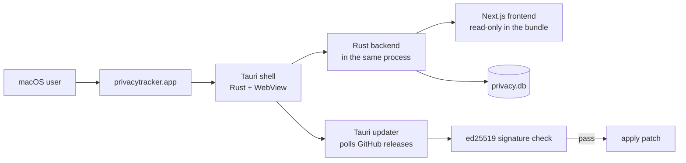
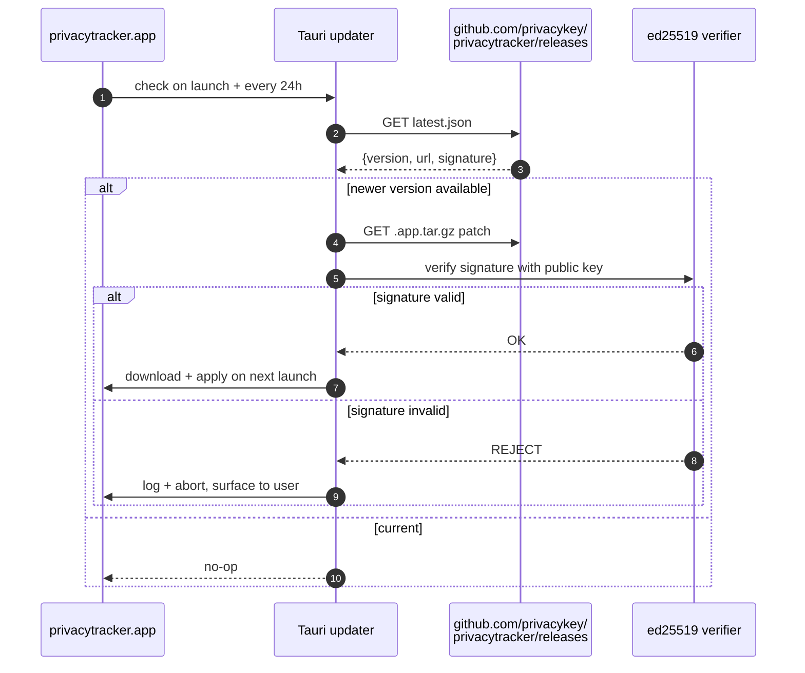

The same Next.js frontend that runs under Docker also runs inside a [Tauri](https://tauri.app) shell as a signed, notarized macOS desktop app. This page is for people who want to *build* or *contribute to* that desktop surface: what Tauri actually does, what serves the app inside it, and how updates flow.

If you just want to install the desktop app, see [Installation → Desktop app](/installation). If you want to build it from source, see [Build from source](/develop/build-from-source).

<Note>
  The desktop app is moving off its bundled Node process onto a Rust backend compiled into the app. Where the two differ, this page describes the app as it ships from the first release on the Rust backend, and [The sidecar Node runtime](#the-sidecar-node-runtime) covers the releases before it. That first release hasn't been published as of September 2026: v0.1.2, the latest release, runs on Node. The [Changelog](/changelog) names the release that makes the switch once it's out.
</Note>

## The big picture



The Rust shell owns the window, the menu bar, deep links, and the auto-updater. It also runs the server: the backend is compiled into the same binary and serves the app on `127.0.0.1:<port>`, reusing the port it had last time. The user's browser-equivalent (WKWebView) loads the same UI a Docker user sees through Chrome. Releases before the Rust backend spawn a Node process for the server instead.

## Why this shape

Three constraints pulled the design here:

1. **One frontend, three distribution surfaces.** Docker users get the Next.js bundle directly. Homebrew installs the same `.app` Tauri produces. The desktop app serves the same built frontend from its Rust backend, which answers the same HTTP API as the Node server, so every UI change reaches all three. Releases before the Rust backend run the Next.js bundle itself as a child process.
2. **Native file-system access for backups + diagnostics.** Pure-web app would need to ask the user every time it touched a file. Tauri exposes safe file IO through the Rust IPC layer.
3. **Signed auto-updates.** macOS Gatekeeper + ed25519-verified patches = silent, safe updates. A Docker user has no equivalent; they `docker compose pull` manually.

## The Rust backend

From the first release on the Rust backend there is no second process. When `privacytracker.app` launches:

<Steps>
  <Step title="Tauri finds the data directory">
    `src-tauri/src/backend.rs` resolves `~/Library/Application Support/privacytracker`, the directory the sidecar releases use, for either backend, so either build finds the database the other wrote.
  </Step>
  <Step title="Tauri binds the port it had last time, if it can">
    The last port is kept in `.desktop-port` in the data directory. If it's still free, the app binds `127.0.0.1` on it again; if anything else has it, the app takes a free port and remembers that one instead. A page's origin includes its port, so keeping the port keeps what the page stores in the browser, such as the accessibility quick toggles, from one launch to the next. The sidecar takes a fresh random port at every launch, which loses that state every time.
  </Step>
  <Step title="The server starts inside the app">
    `src-tauri/src/embedded.rs` starts the server on that listener, in the app's own process. It opens and migrates `privacy.db`, starts the scheduled jobs, and serves the frontend from `Contents/Resources/site`, read-only inside the signed bundle. Nothing is extracted into the data directory.

    The server doesn't read the app's environment. The shell hands it a fixed set of variables, such as the data directory, a loopback bind and `PRIVACYTRACKER_RUNTIME=desktop`, and never an admin token, much as the sidecar starts Node from a cleared environment. Nothing in the app's own environment changes who may call the API.
  </Step>
  <Step title="The WebView loads the app">
    There's nothing to wait for: the listener is bound and the server is ready before the window loads `http://127.0.0.1:<port>/`.
  </Step>
  <Step title="Quitting stops the server">
    `Cmd-Q`, tray Quit, menu-bar Quit and updater restart all route through `RunEvent::ExitRequested`. The server stops accepting connections and ends its scheduled jobs, and requests in flight get up to **3 seconds**, the grace the sidecar gets between SIGTERM and SIGKILL. A bulk run cut off there resumes on the next launch, as it does after a crash.
  </Step>
</Steps>

Because the server lives in the app's process, it can't outlive the app and hold on to the SQLite WAL and the port, which is what the sidecar needs its watchdog for. Its log lines also land in the shell's log file (see [Filesystem layout on disk](#filesystem-layout-on-disk)). The minimum stays macOS 13.5: dropping Node doesn't lower it.

## The sidecar Node runtime

Releases before the Rust backend run the server as a separate Node process, the sidecar. When one of them launches:

<Steps>
  <Step title="Tauri picks a free port">
    `src-tauri/src/sidecar.rs` opens an ephemeral TCP socket on `127.0.0.1`, reads back the assigned port, and immediately closes it — so the port is known but not held.
  </Step>
  <Step title="Tauri spawns Node with that port in env">
    The bundled Node binary (`src-tauri/binaries/node-<arch>`) runs the standalone Next.js bundle (`server.js`) with `PORT=<that-port>` and `HOSTNAME=127.0.0.1`. The bundle binds to localhost only — no external network exposure.
  </Step>
  <Step title="Tauri waits for the sidecar to answer">
    `sidecar::wait_until_ready` polls `http://127.0.0.1:<port>/api/apps` every 250 ms with a 2-second per-request timeout, and treats any response with status < 500 as ready — it never parses the body. The overall deadline is `READY_TIMEOUT`, **60 seconds** (the in-source comment records the bump from 30s: standalone-tree extraction takes 5–10s on a slow disk, and Next.js compiles the route on first hit). Once a probe succeeds, the WebView loads `http://127.0.0.1:<port>/` and the user sees the dashboard.

    `/api/ready` exists, but nothing in the Tauri shell uses it — it's the Docker/compose healthcheck and the smoke-test probe. It answers `{ status: "ready" | "not_ready", checks }`, not `{ ok: true }`.
  </Step>
  <Step title="The sidecar watches Tauri, not the other way round">
    Nothing restarts the sidecar. It's spawned once in `main.rs`, and `SidecarHandle` only ever terminates it — if the Node process dies mid-session, the WebView is left pointing at a dead port and the user has to relaunch.

    The liveness relationship runs in the opposite direction. `sidecar.rs` passes `PRIVACYTRACKER_PARENT_PID` (Tauri's own PID) into the child, and `lib/parent-watchdog.ts` — installed from `instrumentation.ts` — probes that PID with signal 0 every 3 seconds after a 5-second initial delay, calling `process.exit(0)` when it disappears. That's what stops a Force Quit, `kill -9`, or Rust panic from leaving an orphaned Node process holding the SQLite WAL and the listening port. The clean-quit path is handled by SIGTERM from the Rust side; the watchdog covers the unclean ones.
  </Step>
  <Step title="Tauri kills the sidecar on app quit">
    `Cmd-Q` — and tray Quit, menu-bar Quit, and updater restart, all of which route through `RunEvent::ExitRequested` — sends `SIGTERM` to the sidecar's whole process group, then polls `try_wait()` every 50 ms for up to **3 seconds**. Still alive at the deadline, it escalates to `SIGKILL`; SQLite WAL crash recovery makes that safe either way. On Windows there's no SIGTERM step — the code falls straight through to `TerminateProcess`.
  </Step>
</Steps>

Why a sidecar instead of embedding Node into the Rust binary? Two reasons. First, Tauri's WebView doesn't speak Node — it's a browser engine, not a JavaScript runtime with filesystem access. Second, this lets the same `npm run build` artefact serve all three distribution surfaces; embedding would mean a separate build pipeline.

## Bundling the right Node

Only the sidecar releases carry Node. The Rust backend bundles none, so nothing in this section applies to it.

`src-tauri/binaries/` ships a Node runtime per supported architecture:

```
src-tauri/binaries/
├── node-aarch64-apple-darwin
└── node-x86_64-apple-darwin
```

These are the official Node release tarballs, unpacked, signed during the release pipeline. Tauri's build pipeline copies the right binary into the bundle based on `--target`.

When upstream Node ships a new LTS, the [Tauri Bundled Node guide on the Plane board](https://sites.plane.so/issues/39b6604351894f09a5e903acce37d265) walks through:

- Downloading the new Node tarball for both arches.
- Verifying the SHA-256 from `nodejs.org/dist/v.../SHASUMS256.txt`.
- Re-codesigning the binaries with our Developer ID.
- Re-pinning `engines.node` in `package.json` to match.

The version is intentionally pinned — better-sqlite3's native `.node` add-on is built against a specific Node ABI. A mismatch produces *NODE_MODULE_VERSION* errors at sidecar startup.

## Standalone build mode

The Rust backend doesn't use a standalone tree. It serves the regular `next build` output, copied into the bundle's `site/` folder: the prerendered pages, the static chunks and `public/`, about 9 MB, and no server code.

The sidecar runs `npm run build:standalone`, which is `BUILD_STANDALONE=1 next build --webpack && node ./scripts/stage-standalone.mjs`.

Two things differ from the regular `npm run build`:

1. **`BUILD_STANDALONE=1`** flips `next.config.js` into Next.js's [standalone output mode](https://nextjs.org/docs/app/building-your-application/deploying#docker-image), which produces a self-contained `.next/standalone/` directory with a minimal `node_modules` containing only what's actually used at runtime. Even so, the tree the sidecar releases ship comes to about 200 MB.
2. **`scripts/stage-standalone.mjs`** copies the standalone output, the public assets, and the better-sqlite3 native module into the right layout for `src-tauri/binaries` to pick up.

The stage script also strips dev-only files (test fixtures, source maps, the iPhone import helper's Python tests) that aren't needed at runtime.

## The auto-updater



The public key for verification is **embedded in `tauri.conf.json` at build time**. The matching private key is held offline; only the release pipeline (`.github/workflows/macos-release.yml`) signs `latest.json` + the patch tarball during a `Run workflow` action. A leaked private key would be the most serious incident in privacytracker's threat model — it would let an attacker push a signed malicious update to every desktop install. The mitigation is keeping the key offline and air-gapped.

If a signature ever fails to verify, Tauri:

1. Drops the patch.
2. Logs to `audit_log` (`update_signature_invalid`).
3. Surfaces a notification to the user.
4. Does not retry the same patch.

The updater has no opt-out switch — the plugin is registered unconditionally in `src-tauri/src/main.rs` and `plugins.updater.active` is `true`. For Tier 3 (public-internet) deploys that need deterministic update timing, see [Hardening → Disable inbound auto-update on Tier 3](/hardening#disable-inbound-auto-update-on-tier-3) for the workarounds that actually exist.

## Filesystem layout on disk

```
~/Library/Application Support/privacytracker/
├── privacy.db                         SQLite DB (the same shape Docker sees)
├── privacy.db-wal                     WAL journal while running
├── privacy.db-shm                     shared-memory file
├── backup-signing.key                 per-install HMAC key for backup bundles (0600)
├── backups/                           server-local rolling snapshots (Settings → Backup)
└── .desktop-port                      the port to try first at the next launch
```

This is the directory the sidecar releases use, and the Rust backend keeps the database in the same format. Either build opens what the other left behind, WAL included, which is what makes a rollback from the Rust backend to a Node build safe.

Nothing is extracted here any more. The sidecar releases unpack a ~200 MB standalone tree into `standalone/`, with a `.standalone-extracted-from-size-mtime` marker beside it, on first run and again after every update. The Rust backend never reads either and leaves both where an earlier release put them. You can delete them to get the space back; a sidecar release extracts a fresh copy if you go back to one.

There is no `logs/` directory here. `tauri-plugin-log` writes to Tauri's `LogDir` (`~/Library/Logs/org.privacykey.privacytracker/` on macOS) as a single rolling file holding the Rust shell's log. **Settings → Show log folder** opens it (the `open_log_dir` command). On the Rust backend the server's log lines go there too, because the server logs through the same `log` facade, in the same process.

There is no `sidecar.log` at all. On the sidecar releases, Node's stdout and stderr are `Stdio::inherit()`, so its output goes to the parent's stdout, visible only when the app is launched from a terminal:

```bash
/Applications/privacytracker.app/Contents/MacOS/privacytracker
```

That's the diagnostic mode to reach for when boot fails, on either backend: a backend that can't start prints the reason there before the app exits.

The `data/` directory you'd see in a Docker install corresponds to this entire folder on the desktop. A backup bundle from one is restorable into the other, with the untrusted opt-in — see [Backup & restore → Migrating between install paths](/backup-and-restore#migrating-between-install-paths).

On the Rust backend, the frontend and the licence notices ship inside the signed bundle:

```
/Applications/privacytracker.app/Contents/Resources/
├── site/                              the frontend the server serves, read-only
└── third-party/
    ├── NOTICE                         privacytracker's own notice
    ├── LICENSE                        the Apache-2.0 licence that notice refers to
    ├── V8-LICENSE                     for the ports of V8's date parser and JSON.parse error messages
    └── THIRD-PARTY-RUST.md            every Rust crate compiled into the app, with version, licence and source
```

The app's Legal page (`/legal`, the **Legal** link at the bottom left of every page) names the crates chosen directly, gives the licence breakdown, and links the full list.

## Touch ID

`src-tauri/src/touch_id.rs` wraps macOS LocalAuthentication (`LAPolicy::DeviceOwnerAuthentication` — Touch ID with login-password fallback) and exposes it as the `authenticate_touch_id` command, with a 60-second timeout. On non-macOS hosts it always returns `true`.

Three call sites today:

1. **cfgutil app uninstall.** A native prompt runs before the destructive `cfgutil` subprocess. The wizard's "type DELETE" step is webview-side, so a compromised webview could invoke the command directly — the native modal is what it can't fake. Documented at [Devices → Device actions](/devices#device-actions).
2. **Enabling "Require unlock"** in Desktop settings — confirms the user before persisting `require_unlock`. Note the gate on window reveal isn't implemented yet: `reveal_main_window` always reveals immediately and defers the lock overlay to the webview, which doesn't draw one.
3. **The "Test Touch ID" button** in Desktop settings.

`POST /api/reset` involves neither. `SettingsView.resetAllData()` is a bare `fetch("/api/reset", { method: "POST" })` with no headers — the route is protected by the same-origin proxy check, a 30-per-10-minutes rate limit, and the admin token when one is required, returning 401 otherwise. The admin token reaches the server as the `pt_admin_token` cookie the user establishes through `/api/auth/admin-token/login`; the Rust side never reads it from the environment and never injects it.

Touch ID is also deliberately *not* used to derive backup-encryption keys — bundles have to stay portable to the web build and to other machines.

## Things that commonly trip people up

- **The app quits as soon as it opens (Rust backend).** The backend couldn't start, so no window appears. Launch the binary from Terminal (`/Applications/privacytracker.app/Contents/MacOS/privacytracker`): the line starting `[privacytracker] FATAL: failed to start the backend` gives the reason. If it says it could not find a built frontend, the bundle is incomplete; reinstall it from the latest DMG.
- **Sidecar fails to start with `NODE_MODULE_VERSION X does not match Y`.** better-sqlite3's native module was built against a different Node ABI. Either rebuild it (`npm rebuild better-sqlite3`) against the bundled Node version, or update the bundled Node to match. The [Tauri Bundled Node guide on the Plane board](https://sites.plane.so/issues/39b6604351894f09a5e903acce37d265) has the recipe.
- **App opens but the WebView is blank (sidecar releases).** The sidecar didn't answer `/api/apps` within the 60-second readiness deadline. Relaunch from Terminal (`/Applications/privacytracker.app/Contents/MacOS/privacytracker`) to see the sidecar's stdout, and check `~/Library/Logs/org.privacykey.privacytracker/` for the Rust shell's log. Usually it's a database lock from a previous bad shutdown (delete `privacy.db-wal` and `privacy.db-shm` while the app is closed) or a port conflict (rare on macOS, more common on Linux).
- **Auto-update gets stuck.** Tauri caches the *checked* state for 24h regardless of outcome. To force a re-check: quit the app, delete `~/Library/Caches/org.privacykey.privacytracker/`, relaunch.
- **`spctl --assess` fails with `code object is not signed at all`.** The bundle was tampered with after signing, or the download was truncated. Re-download from GitHub releases.

## Where the code lives

| What | File |
|---|---|
| Tauri config (window, updater public key, bundle metadata) | `src-tauri/tauri.conf.json` |
| Rust entry + backend lifecycle | `src-tauri/src/main.rs` and `src-tauri/src/backend.rs`, with `embedded.rs` for the Rust backend and `sidecar.rs` for the Node sidecar |
| The Rust backend's server | `core/` |
| Touch ID command | `src-tauri/src/touch_id.rs` |
| What the Rust backend's bundle carries | `scripts/stage-site.mjs` (the frontend), `scripts/stage-notices.mjs` (the notices), `scripts/generate-rust-notices.mjs` (the crate list, and the summary the Legal page shows) |
| Standalone build pipeline (sidecar releases) | `scripts/stage-standalone.mjs`, `next.config.js` (look for `BUILD_STANDALONE`) |
| macOS release workflow | `.github/workflows/macos-release.yml` |
| Cask formula (Homebrew tap) | `Casks/privacytracker.rb` in the separate [privacykey/homebrew-tap](https://github.com/privacykey/homebrew-tap) repo — regenerated on every release by `macos-release.yml`, so manual edits are overwritten |

The release pipeline itself (signing, notarization, the GitHub Actions specifically) is intentionally not documented in the public docs — that's release-engineering material kept in the private signing-setup repo.
