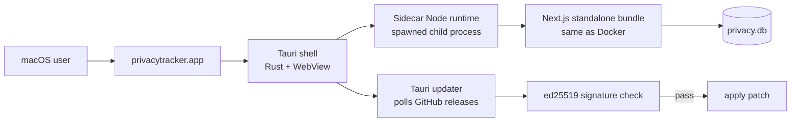
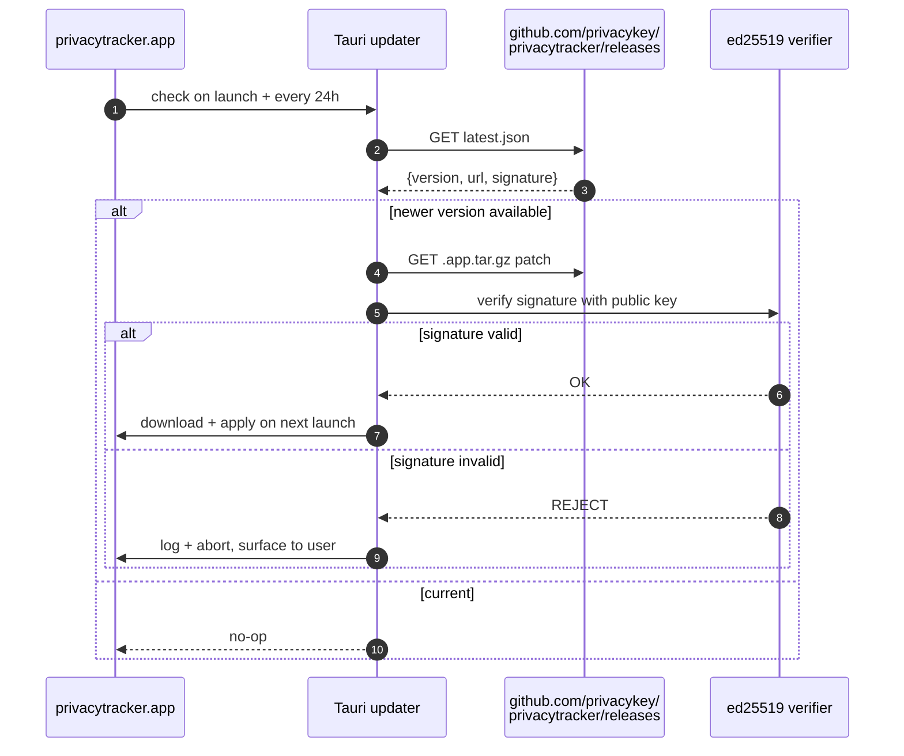

The same Next.js bundle that runs under Docker also runs inside a [Tauri](https://tauri.app) shell as a signed, notarized macOS desktop app. This page is for people who want to *build* or *contribute to* that desktop surface — what Tauri actually does, what the sidecar runtime is, and how updates flow.

If you just want to install the desktop app, see [Installation → Desktop app](/installation). If you want to build it from source, see [Build from source](/develop/build-from-source).

## The big picture



The Rust shell owns the window, the menu bar, deep links, and the auto-updater. It spawns the sidecar Node process at startup and proxies the WebView to it on `127.0.0.1:<dynamic-port>`. The user's browser-equivalent (WKWebView) loads the same UI a Docker user sees through Chrome.

## Why this shape

Three constraints pulled the design here:

1. **One Next.js bundle, three distribution surfaces.** Docker users get the bundle directly. Homebrew installs the same `.app` Tauri produces. Tauri runs the bundle as a child process. Maintaining one runtime to rule them all means the desktop app inherits every API change and every bug fix without parallel codebases.
2. **Native file-system access for backups + diagnostics.** Pure-web app would need to ask the user every time it touched a file. Tauri exposes safe file IO through the Rust IPC layer.
3. **Signed auto-updates.** macOS Gatekeeper + ed25519-verified patches = silent, safe updates. A Docker user has no equivalent; they `docker compose pull` manually.

## The sidecar Node runtime

When `privacytracker.app` launches:

<Steps>
  <Step title="Tauri picks a free port">
    `src-tauri/src/sidecar.rs` opens an ephemeral TCP socket on `127.0.0.1`, reads back the assigned port, and immediately closes it — so the port is known but not held.
  </Step>
  <Step title="Tauri spawns Node with that port in env">
    The bundled Node binary (`src-tauri/binaries/node-<arch>`) runs the standalone Next.js bundle (`server.js`) with `PORT=<that-port>` and `HOSTNAME=127.0.0.1`. The bundle binds to localhost only — no external network exposure.
  </Step>
  <Step title="Tauri waits for /api/ready">
    The Rust shell polls `http://127.0.0.1:<port>/api/ready` with a 30-second timeout. Once it returns `{ "ok": true }`, the WebView loads `http://127.0.0.1:<port>/` and the user sees the dashboard.
  </Step>
  <Step title="Tauri keeps the child process alive">
    `tauri-plugin-process` watches the sidecar PID. If it dies (panic, OOM, SIGTERM from `kill -9`), Tauri restarts it. The user sees a brief reload; the SQLite WAL recovery handles any in-flight writes.
  </Step>
  <Step title="Tauri kills the sidecar on app quit">
    `Cmd-Q` triggers a `SIGTERM` to the sidecar followed by a 5-second drain window. The Node process flushes any in-flight DB writes (better-sqlite3 is synchronous, so this is usually instant) and exits.
  </Step>
</Steps>

Why a sidecar instead of embedding Node into the Rust binary? Two reasons. First, Tauri's WebView doesn't speak Node — it's a browser engine, not a JavaScript runtime with filesystem access. Second, this lets the same `npm run build` artefact serve all three distribution surfaces; embedding would mean a separate build pipeline.

## Bundling the right Node

`src-tauri/binaries/` ships a Node runtime per supported architecture:

```
src-tauri/binaries/
├── node-aarch64-apple-darwin
└── node-x86_64-apple-darwin
```

These are the official Node release tarballs, unpacked, signed during the release pipeline. Tauri's build pipeline copies the right binary into the bundle based on `--target`.

When upstream Node ships a new LTS, the [Tauri Bundled Node guide on the Plane board](https://sites.plane.so/issues/39b6604351894f09a5e903acce37d265) walks through:

- Downloading the new Node tarball for both arches.
- Verifying the SHA-256 from `nodejs.org/dist/v.../SHASUMS256.txt`.
- Re-codesigning the binaries with our Developer ID.
- Re-pinning `engines.node` in `package.json` to match.

The version is intentionally pinned — better-sqlite3's native `.node` add-on is built against a specific Node ABI. A mismatch produces *NODE_MODULE_VERSION* errors at sidecar startup.

## Standalone build mode

The sidecar runs `npm run build:standalone`, which is `BUILD_STANDALONE=1 next build --webpack && node ./scripts/stage-standalone.mjs`.

Two things differ from the regular `npm run build`:

1. **`BUILD_STANDALONE=1`** flips `next.config.js` into Next.js's [standalone output mode](https://nextjs.org/docs/app/building-your-application/deploying#docker-image), which produces a self-contained `.next/standalone/` directory with a minimal `node_modules` containing only what's actually used at runtime. The whole bundle is ~30 MB instead of the ~500 MB a `node_modules`-and-all build would be.
2. **`scripts/stage-standalone.mjs`** copies the standalone output, the public assets, and the better-sqlite3 native module into the right layout for `src-tauri/binaries` to pick up.

The stage script also strips dev-only files (test fixtures, source maps, the iPhone import helper's Python tests) that aren't needed at runtime.

## The auto-updater



The public key for verification is **embedded in `tauri.conf.json` at build time**. The matching private key is held offline; only the release pipeline (`.github/workflows/macos-release.yml`) signs `latest.json` + the patch tarball during a `Run workflow` action. A leaked private key would be the most serious incident in privacytracker's threat model — it would let an attacker push a signed malicious update to every desktop install. The mitigation is keeping the key offline and air-gapped.

If a signature ever fails to verify, Tauri:

1. Drops the patch.
2. Logs to `audit_log` (`update_signature_invalid`).
3. Surfaces a notification to the user.
4. Does not retry the same patch.

For Tier 3 (public-internet) deploys, you can disable auto-updates entirely with `AUDITOR_DISABLE_AUTO_UPDATE=1` — see [Hardening → Disable inbound auto-update on Tier 3](/hardening#disable-inbound-auto-update-on-tier-3).

## Filesystem layout on disk

```
~/Library/Application Support/privacytracker/
├── privacy.db                         SQLite DB (the same shape Docker sees)
├── privacy.db-wal                     WAL journal while running
├── privacy.db-shm                     shared-memory file
├── snapshots/                         server-local rolling backups (Settings → Backup)
└── logs/
    ├── app.log                        Rust shell log (window events, IPC)
    └── sidecar.log                    Node sidecar log (HTTP, DB, AI calls)
```

The `data/` directory you'd see in a Docker install corresponds to this entire folder on the desktop. A backup bundle from one is restorable into the other — see [Backup & restore → Migrating between install paths](/backup-and-restore#migrating-between-install-paths).

## Touch ID

`src-tauri/src/touch_id.rs` exposes a Tauri command that prompts the user via macOS LocalAuthentication for biometric confirmation. We use it for one thing today: confirming `POST /api/reset` from the desktop UI without requiring the user to type the admin token. The command returns a boolean to the WebView, which then includes the admin token (read from process env, never the WebView) in the Reset request.

This is a desktop-only convenience. The web/Docker surfaces still require manual token entry.

## Things that commonly trip people up

- **Sidecar fails to start with `NODE_MODULE_VERSION X does not match Y`.** better-sqlite3's native module was built against a different Node ABI. Either rebuild it (`npm rebuild better-sqlite3`) against the bundled Node version, or update the bundled Node to match. The [Tauri Bundled Node guide on the Plane board](https://sites.plane.so/issues/39b6604351894f09a5e903acce37d265) has the recipe.
- **App opens but the WebView is blank.** Sidecar didn't reach `/api/ready` within the 30-second timeout. Tail `~/Library/Application Support/privacytracker/logs/sidecar.log` — usually it's a database lock from a previous bad shutdown (delete `privacy.db-wal` and `privacy.db-shm` while the app is closed) or a port conflict (rare on macOS, more common on Linux).
- **Auto-update gets stuck.** Tauri caches the *checked* state for 24h regardless of outcome. To force a re-check: quit the app, delete `~/Library/Caches/com.privacykey.privacytracker/`, relaunch.
- **`spctl --assess` fails with `code object is not signed at all`.** The bundle was tampered with after signing, or the download was truncated. Re-download from GitHub releases.

## Where the code lives

| What | File |
|---|---|
| Tauri config (window, updater public key, bundle metadata) | `src-tauri/tauri.conf.json` |
| Rust entry + sidecar lifecycle | `src-tauri/src/main.rs`, `src-tauri/src/sidecar.rs` |
| Touch ID command | `src-tauri/src/touch_id.rs` |
| Standalone build pipeline | `scripts/stage-standalone.mjs`, `next.config.js` (look for `BUILD_STANDALONE`) |
| macOS release workflow | `.github/workflows/macos-release.yml` |
| Cask formula (Homebrew tap) | `homebrew-tap/Casks/privacytracker.rb` |

The release pipeline itself (signing, notarization, the GitHub Actions specifically) is intentionally not documented in the public docs — that's release-engineering material kept in the wiki and the private signing-setup repo.
